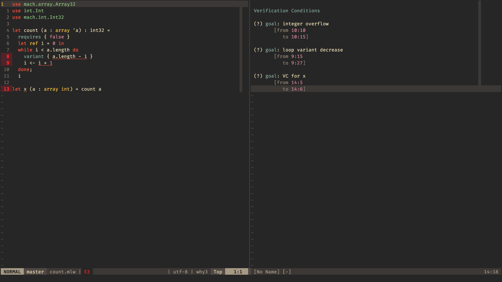

# Neovim extension for Why3

## Prerequisites

- [Latest stable version of Neovim](https://github.com/neovim/neovim/releases/tag/stable)
- The lsp neovim package: *neovim/nvim-lspconfig* (see [here](https://github.com/neovim/nvim-lspconfig))
- WhyCode binary: download the last artifact for you distribution from the
  [releases list](https://github.com/xldenis/whycode/actions)

## Installation
- packer
  ```lua
  use { "paulpatault/whycode" }
  ```

- lazy
  ```lua
  return { "paulpatault/whycode" }
  ```

## Configuration

Add the following to your LSP configuration:
```lua
local function map (bufnr, mod, key, f)
  vim.keymap.set(mod, key, f, { buffer = bufnr, remap = false })
end

local capabilities = vim.lsp.protocol.make_client_capabilities()

local function on_attach_why3(client, bufnr)
  map("n", "<leader>ca", function() vim.lsp.buf.code_action()  end)

  map(bufnr, "n", "<C-R>", function()
    local uri = client.workspace_folders[1].uri
    local ok = vim.lsp.buf_notify(0, "proof/reloadSession", { uri })
    if ok then
      print("Session reloaded")
    else
      local err = string.format("[ERROR] Notification proof/reloadSession failed (with uri=%s)", uri)
      error(err)
    end
  end, "[R]eload Session")

end

require("whycode").setup({
  lsp = {
    on_attach = on_attach_why3,
    cmd = { ".../whycode.exe" }, --path to executable
    verbose = false,
    capabilities = capabilities
  },
})
```

## State of the art



## TODO

- [ ] documentation
- [ ] tasks view : WIP
- [ ] goal view

## Acknowledgment

Some ideas are taken from [coq lsp for neovim](https://github.com/tomtomjhj/coq-lsp.nvim).
